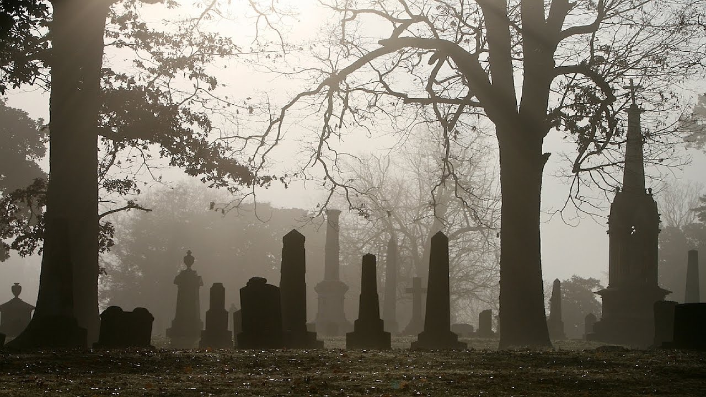

    

# City of Nashville historic burial data cleaning and analysis
The city of Nashville provides a dataset of known burials in city cemeteries from 1846 through 1979. This dataset holds factual information, but it also offers a fascinating glimpse into historical trends in medicine, literacy, racial equality, and more.

#### Data tasks and questions:
1.	Clean and chart the 10 most common (known) recorded causes of death, and evaluate the counts of each type.

2.	Create chart showing number of burials per year. In what years were there the most burials? Any idea as to why?

3.  Examine deaths for each decade beginning with the 1850s. Look at the total number of deaths and the proportion of male deaths to female deaths and create a clustered bar chart to show how male and female deaths have changed over time.

4. Next we'll look at how age at time of death has changed over time. We'll add a column to the original dataset to classify each row to one of the following categories (0-18, 19-25, 26-40, 41-64, and 65+). Make a series of pie charts or donut charts to show the breakdown of each age group for these four periods: before 1880, 1881-1900, 1900-1920, after 1920.

5. Examine burials by month. Are there months with higher burials? What are the top five causes of death for each month?

6. And other questions..
